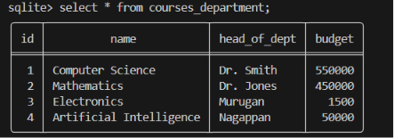
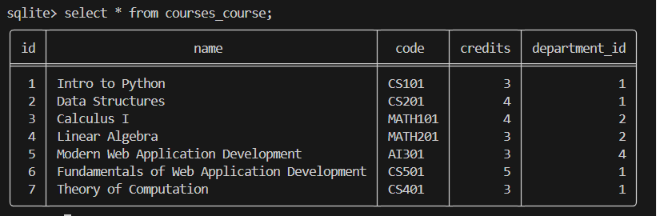
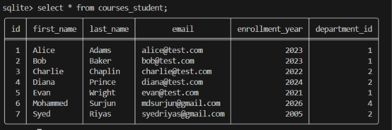
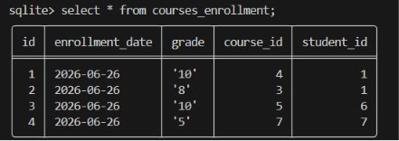

# Django ORM Database Inserts

This document records the exact Django ORM code used to populate the tables in `db.sqlite3` for `handson_02` one row at a time.

Then, import the models and the `date` module:
```python
from courses.models import Department, Course, Student, Enrollment
from datetime import date
```

---

## 1. Populating `Department` Table

```python
dept1 = Department(name="Computer Science", head_of_dept="Dr. Smith", budget=550000.00)
dept1.save()

dept2 = Department(name="Mathematics", head_of_dept="Dr. Jones", budget=450000.00)
dept2.save()

dept3 = Department(name="Electronics", head_of_dept="Murugan", budget=1500.00)
dept3.save()

dept4 = Department(name="Artificial Intelligence", head_of_dept="Nagappan", budget=50000.00)
dept4.save()
```

### Output


---

## 2. Populating `Course` Table

```python
course1 = Course(name="Intro to Python", code="CS101", credits=3, department=dept1)
course1.save()

course2 = Course(name="Data Structures", code="CS201", credits=4, department=dept1)
course2.save()

course3 = Course(name="Calculus I", code="MATH101", credits=4, department=dept2)
course3.save()

course4 = Course(name="Linear Algebra", code="MATH201", credits=3, department=dept2)
course4.save()

course5 = Course(name="Modern Web Application Development", code="AI301", credits=3, department=dept4)
course5.save()

course6 = Course(name="Fundamentals of Web Application Development", code="CS501", credits=5, department=dept1)
course6.save()

course7 = Course(name="Theory of Computation", code="CS401", credits=3, department=dept1)
course7.save()
```

### Output



---

## 3. Populating `Student` Table

```python
student1 = Student(first_name="Alice", last_name="Adams", email="alice@test.com", enrollment_year=2023, department=dept1)
student1.save()

student2 = Student(first_name="Bob", last_name="Baker", email="bob@test.com", enrollment_year=2023, department=dept1)
student2.save()

student3 = Student(first_name="Charlie", last_name="Chaplin", email="charlie@test.com", enrollment_year=2022, department=dept2)
student3.save()

student4 = Student(first_name="Diana", last_name="Prince", email="diana@test.com", enrollment_year=2024, department=dept2)
student4.save()

student5 = Student(first_name="Evan", last_name="Wright", email="evan@test.com", enrollment_year=2021, department=dept1)
student5.save()

student6 = Student(first_name="Mohammed", last_name="Surjun", email="mdsurjun@gmail.com", enrollment_year=2026, department=dept4)
student6.save()

student7 = Student(first_name="Syed", last_name="Riyas", email="syedriyas@gmail.com", enrollment_year=2005, department=dept2)
student7.save()
```

### Output


---

## 4. Populating `Enrollment` Table

```python
enrollment1 = Enrollment(student=student1, course=course4, enrollment_date=date(2026, 6, 26), grade="10")
enrollment1.save()

enrollment2 = Enrollment(student=student1, course=course3, enrollment_date=date(2026, 6, 26), grade="8")
enrollment2.save()

enrollment3 = Enrollment(student=student6, course=course5, enrollment_date=date(2026, 6, 26), grade="10")
enrollment3.save()

enrollment4 = Enrollment(student=student7, course=course7, enrollment_date=date(2026, 6, 26), grade="5")
enrollment4.save()
```

### Output

