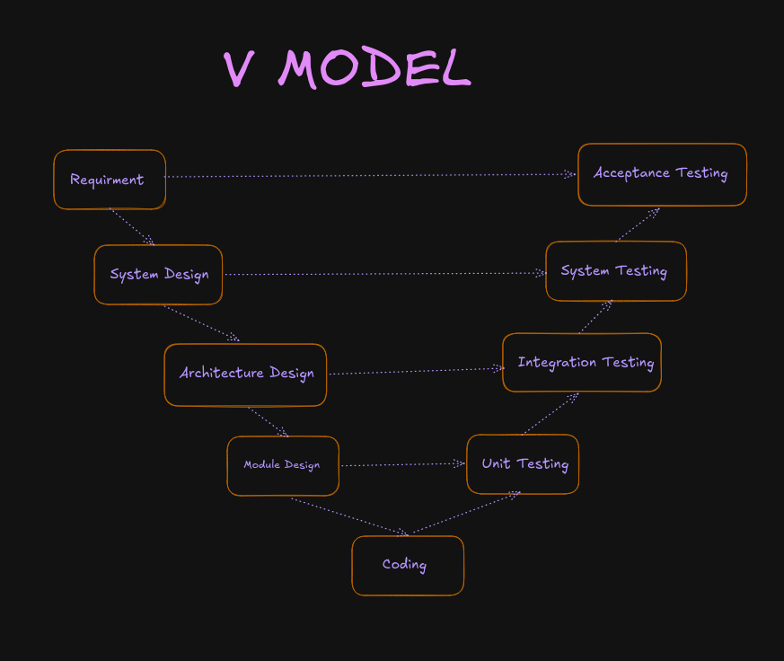

# HANDSON 02: SDLC vs TDLC - V-Model & Agile QA Integration

---

## STEP 9: V-Model Mapping

### V-Model Diagram
Draw or describe the V Model:



---

## STEP 10: Left-Side Testing Artifacts

The core concept of the V-Model is that testing preparation begins the moment development begins. Here are the artifacts produced during the left-side phases:

### Requirements Analysis ↔ Acceptance Testing
* **Test Artifact Produced:** Acceptance Test Plan and UAT Test Cases. QA creates these based directly on the business requirements before any code is written.

### System Design ↔ System Testing
* **Test Artifact Produced:** System Test Plan. QA defines the end-to-end testing scenarios based on the overall system design.

### Architecture Design ↔ Integration Testing
* **Test Artifact Produced:** Integration Test Plan. Testers map out how different modules (like the API and Database) will communicate and write test cases to verify those connections.

### Module Design ↔ Unit Testing
* **Test Artifact Produced:** Unit Test Cases. Developers look at the low-level design for specific functions and write tests to verify those exact functions.

---

## STEP 11: Entry and Exit Criteria for Test Phases

### 1. Unit Testing
* **Entry Criteria:** The module design is complete, and the developer has written the code for the specific function. The code must compile without basic syntax errors.
* **Exit Criteria:** All written unit tests have been executed. 100% of the unit tests pass, and any identified bugs in that specific code block are fixed.

### 2. Integration Testing
* **Entry Criteria:** Unit testing is signed off as complete. The separate modules (e.g., API and database) have been linked together, and the integration test environment is set up.
* **Exit Criteria:** All integration test cases are executed. Modules communicate successfully without crashing. No open Critical or High severity defects exist in the integration layer.

### 3. System Testing
* **Entry Criteria:** Integration testing is complete and signed off. The entire application is fully assembled and deployed to a stable QA testing environment that mimics real-world conditions.
* **Exit Criteria:** All end-to-end system test cases are executed. The overall defect count is below the acceptable threshold, and zero Critical or High severity bugs remain open.

### 4. Acceptance Testing (UAT)
* **Entry Criteria:** System testing is successfully closed. The UAT environment is prepared, and the actual business users (or client representatives) are available to test.
* **Exit Criteria:** Business users complete all real-world scenarios. Users officially sign off that the software meets their business requirements and is ready for production release.

---

## STEP 12: Early QA Involvement in SDLC

### During Requirements Analysis
* **Action:** QA should review the initial API requirements before any code is written.
* **Value:** QA can catch missing rules or ambiguities. For example, if the requirement says "Users can add a course," QA will ask: "What is the maximum character limit for the course name? Can credits be negative? What happens if two courses have the same ID?" Fixing these missing details in a document costs nothing, whereas fixing them later in code is expensive.

### During Architecture / System Design
* **Action:** QA should review the proposed API endpoint structures and database schemas with the developers.
* **Value:** QA can ensure the system is being built in a way that is actually testable. They can also verify that error handling (like returning a 400 or 404 status code) is built into the design from day one, rather than trying to patch it in later.

---

## STEP 13: The Problems with Waterfall Testing

In a traditional Waterfall methodology, testing is left entirely to the end of the project. For the Course Management API, this causes three major problems:

* **Bugs are extremely expensive to fix:** If QA discovers during final testing that the database schema doesn't support a required `department_id` field, the developers have to rip apart the database and rewrite the API code. This takes weeks.
* **The "Time Crunch" effect:** Development always takes longer than expected. Because testing is at the very end, the QA schedule gets squeezed. Testers are forced to rush, which means critical edge cases (like testing how the API handles concurrent requests) might be skipped to meet the deadline.
* **Delayed developer feedback:** By the time QA finds a bug in the `POST /api/courses/` endpoint, the developer who wrote it months ago has already moved on to another project. They have to spend hours re-familiarizing themselves with the code just to fix a simple typo.

---

## STEP 14: The QA Role in Agile Ceremonies

In Agile, QA is integrated into the team from day one. Here is what a QA Engineer does in each Agile ceremony:

* **Sprint Planning:** QA reviews upcoming user stories, helps define clear Acceptance Criteria, and ensures adequate time is estimated for testing activities (not just coding).
* **Daily Standup:** QA provides quick updates on testing progress, what they plan to test that day, and raises any blockers (e.g., "I can't test the new endpoint because the QA database is down").
* **Sprint Review:** QA often leads or assists in the live demonstration of the newly tested features to stakeholders, proving that the software works according to the acceptance criteria.
* **Sprint Retrospective:** QA discusses testing bottlenecks, suggests process improvements (e.g., "We need to automate our API tests earlier"), and celebrates quality wins with the team.

---

## STEP 15: Shift-Left Practices Applied to the API

The Shift-Left principle prevents defects instead of just finding them. Here are four concrete practices applied to the Course Management API:

* **Reviewing requirements for testability:** Before the developer starts coding the `POST /api/courses/` endpoint, QA reviews the user story and asks clarifying questions (e.g., "What is the maximum number of credits allowed?"). This prevents logic bugs before they are ever written.
* **Writing test cases before code (TDD/BDD):** QA and developers write the automated tests first (e.g., a test expecting a `201 Created` status). The developer then writes the minimum amount of API code required to make that test pass, ensuring the code does exactly what is required and nothing more.
* **Static code analysis:** Setting up automated tools (like Pylint or SonarQube) in the code repository to scan the Flask Python code the moment it is saved. This catches syntax errors and security flaws without anyone having to manually run the application.
* **API contract testing before integration:** Creating a clear Swagger/OpenAPI document that dictates exactly what the JSON payload for a course must look like. The UI team and the backend team can test against this "contract" independently, ensuring that when they finally integrate, they communicate perfectly.

---

## STEP 16: BDD Acceptance Criteria (Gherkin Format)

**User Story:** As a college admin, I want to create a new course, so that students can enroll in it.

### Scenario 1: Successfully create a new course (Happy Path)
```gherkin
Given I am a logged-in college admin
And I have all the valid details for a new course ("Physics", "PHY101", 4 credits, department 1)
When I submit the request to create the course
Then the course should be saved in the database
And the API should return a 201 Created success message
```

### Scenario 2: Attempt to create a course with a duplicate course code
```gherkin
Given a course with the code "PHY101" already exists in the system
When I submit a request to create a new course with the same "PHY101" code
Then the request should be rejected
And the API should return an error message stating the course code must be unique
```

### Scenario 3: Attempt to create a course with missing required fields
```gherkin
Given I am a logged-in college admin
When I submit a request to create a course but leave the "credits" field empty
Then the request should be rejected
And the API should return a 400 Bad Request status with a "Missing required field: credits" message
```